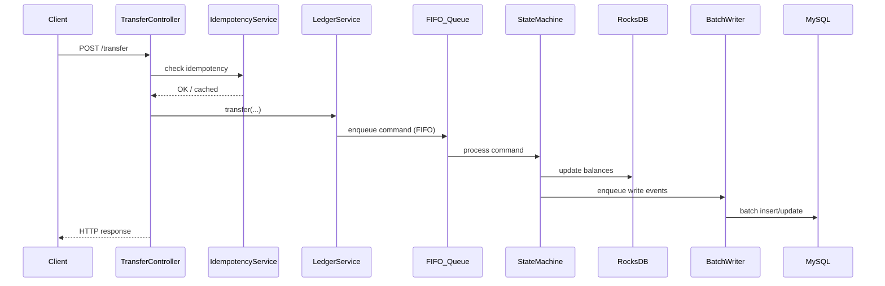
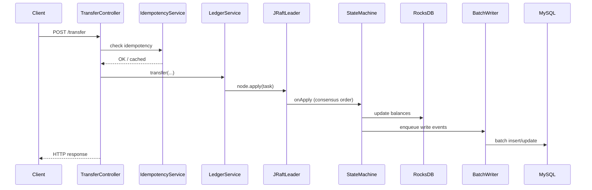
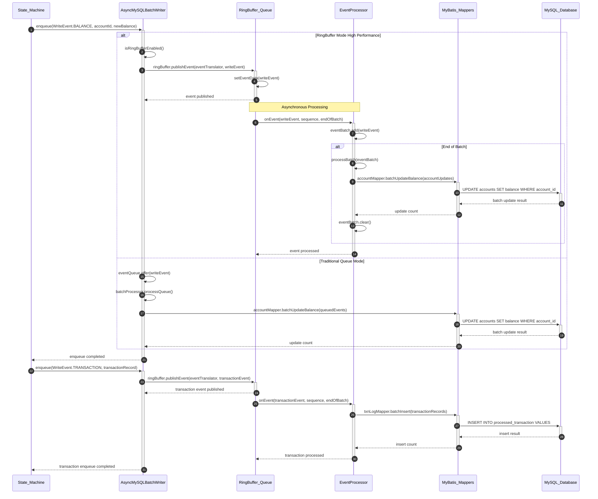
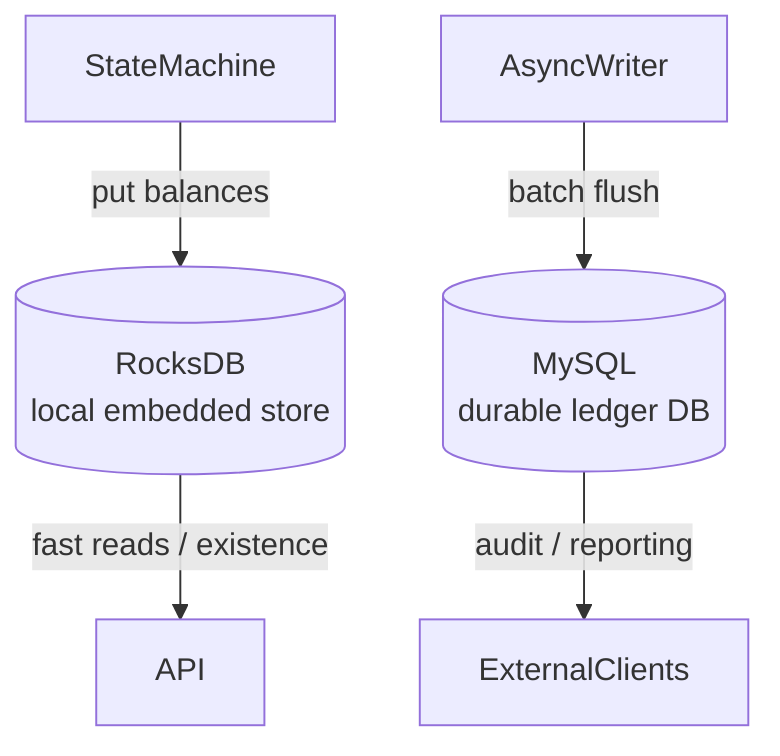
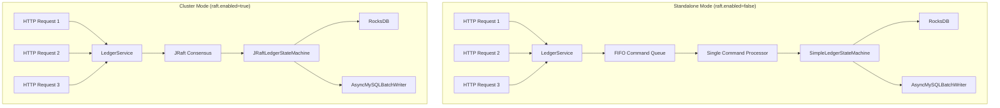
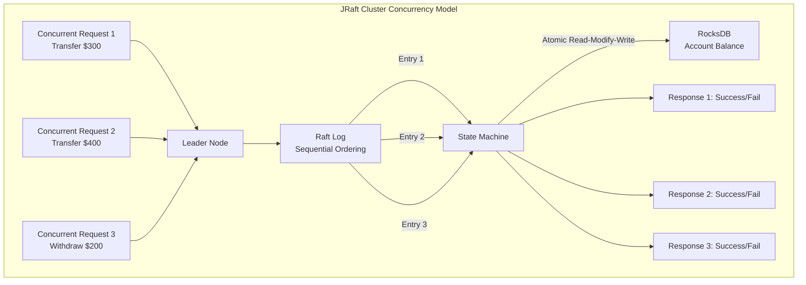

# JRaft Ledger – Core Logic Flow & FIFO Ordering

Below is an end-to-end view of how a **single transfer** request travels through the system when `raft.enabled=true` (clustered mode) and when `raft.enabled=false` (stand-alone mode).  The same pattern applies to account-creation and batch-transfer commands.

## 🔄 FIFO Ordering Guarantees

### ✅ **JRaft Cluster Mode (`raft.enabled=true`)**
- **Strong FIFO Guarantees**: JRaft consensus ensures all commands are applied in the same order across all nodes
- **Sequential Processing**: Commands are processed one-by-one in the `onApply()` method
- **Consensus-Based Ordering**: All nodes receive and apply commands in identical order

### ✅ **Standalone Mode (`raft.enabled=false`) - NEW**
- **FIFO Command Queue**: Added dedicated single-threaded command processor
- **Sequential Execution**: All transfers and account creations are processed sequentially
- **Consistent Ordering**: Prevents race conditions between concurrent requests

## Sequence – Single Transfer

### 🔄 **Detailed Function-Level Sequence Diagrams**

#### **Standalone Mode (raft.enabled=false)**



#### **Cluster Mode (raft.enabled=true)**



#### **AsyncMySQLBatchWriter.enqueue() Process**



#### **JRaft Concurrent Operations on Same User - Detailed Flow**

```mermaid
sequenceDiagram
    autonumber
    participant C1 as Client_1_Transfer_300
    participant C2 as Client_2_Transfer_400
    participant C3 as Client_3_Withdraw_200
    participant API as TransferController
    participant SVC as LedgerService
    participant LEADER as JRaft_Leader
    participant LOG as Raft_Log
    participant STM as State_Machine
    participant RDB as RocksDB

    Note over C1,C3: All operations target User A account balance 1000

    par Concurrent Requests
        C1->>+API: POST /transfer A to B 300
        and C2->>+API: POST /transfer A to C 400
        and C3->>+API: POST /transfer A to Bank 200
    end

    par Service Layer Processing
        API->>+SVC: transfer(A, B, 300, desc1)
        and API->>+SVC: transfer(A, C, 400, desc2)
        and API->>+SVC: transfer(A, Bank, 200, withdrawal)
    end

    par JRaft Command Submission
        SVC->>+LEADER: node.apply(Task TRANSFER A B 300)
        and SVC->>+LEADER: node.apply(Task TRANSFER A C 400)
        and SVC->>+LEADER: node.apply(Task TRANSFER A Bank 200)
    end

    Note over LEADER: Leader determines ordering T1 T2 T3

    LEADER->>+LOG: appendEntry(T1 A to B 300)
    LOG->>LOG: index=100, committed=false
    LEADER->>+LOG: appendEntry(T2 A to C 400)
    LOG->>LOG: index=101, committed=false
    LEADER->>+LOG: appendEntry(T3 A to Bank 200)
    LOG->>LOG: index=102, committed=false

    Note over LEADER,LOG: Consensus achieved entries committed

    LOG->>LOG: markCommitted(100, 101, 102)
    LOG->>+STM: onApply(iterator T1 T2 T3)

    Note over STM: Sequential Processing NO CONCURRENCY

    STM->>STM: processCommand(T1 TRANSFER A B 300)
    STM->>+RDB: getAccountBalance(A)
    RDB-->>-STM: BigDecimal(1000)
    STM->>STM: validate(1000 >= 300) SUCCESS
    STM->>+RDB: put(A, 700)
    RDB-->>-STM: success
    STM->>+RDB: put(B, 300)
    RDB-->>-STM: success
    STM->>STM: appliedIndex.set(100)

    STM->>STM: processCommand(T2 TRANSFER A C 400)
    STM->>+RDB: getAccountBalance(A)
    RDB-->>-STM: BigDecimal(700)
    STM->>STM: validate(700 >= 400) SUCCESS
    STM->>+RDB: put(A, 300)
    RDB-->>-STM: success
    STM->>+RDB: put(C, 400)
    RDB-->>-STM: success
    STM->>STM: appliedIndex.set(101)

    STM->>STM: processCommand(T3 TRANSFER A Bank 200)
    STM->>+RDB: getAccountBalance(A)
    RDB-->>-STM: BigDecimal(300)
    STM->>STM: validate(300 >= 200) SUCCESS
    STM->>+RDB: put(A, 100)
    RDB-->>-STM: success
    STM->>+RDB: put(Bank, 200)
    RDB-->>-STM: success
    STM->>STM: appliedIndex.set(102)

    STM-->>-LOG: onApply completed
    LOG-->>-LEADER: all entries applied successfully

    par Response Propagation
        LEADER-->>-SVC: T1 callback Status.OK()
        and LEADER-->>-SVC: T2 callback Status.OK()
        and LEADER-->>-SVC: T3 callback Status.OK()
    end

    par Client Responses
        SVC-->>-API: CompletableFuture(true)
        API-->>-C1: HTTP 200 success true
        and SVC-->>-API: CompletableFuture(true)
        API-->>-C2: HTTP 200 success true
        and SVC-->>-API: CompletableFuture(true)
        API-->>-C3: HTTP 200 success true
    end

    Note over C1,RDB: Final State A=100 B=300 C=400 Bank=200 Total Transferred 900 All Operations Succeeded
```

## Components & Responsibilities

| Layer | Main Classes | Key Responsibilities |
|-------|--------------|-----------------------|
| **API** | `TransferController`, `BalanceController`, `AdminController`, etc. | Validate HTTP input, invoke services, translate domain errors to HTTP codes. |
| **Idempotency** | `IdempotencyService` | Detect duplicates via in-memory cache; guarantees at-least-once semantics for external callers. |
| **Service** | `LedgerService`, `AccountBusinessService` | Orchestrate domain actions; decide whether to go through Raft or FIFO queue. |
| **FIFO Queue** | `LedgerService.commandQueue` (standalone only) | Single-threaded sequential command processing for FIFO ordering. |
| **Consensus** | `RaftNodeManager`, `JRaftLedgerStateMachine` | Replicate commands, maintain applied index, leader election. |
| **State Machine** | `JRaftLedgerStateMachine` (cluster) or `SimpleLedgerStateMachine` (stand-alone) | Apply `CREATE_ACCOUNT` & `TRANSFER` commands, update RocksDB, emit `WriteEvent`s. |
| **Persistence** | `AsyncMySQLBatchWriter` + MyBatis mappers | High-throughput batch flush of balance deltas & processed transactions to MySQL. |
| **Local KV** | `RocksDBService` | Fast read path for balances & account existence checks. |

## Data Stores



* **RocksDB** holds the hot path state for each node, enabling millisecond-level balance queries.
* **MySQL** is used for durable, query-friendly storage of balances (`accounts` table) and immutable history (`processed_transaction` table).

## FIFO Ordering Architecture



## Happy-Path Transfer

### Cluster Mode:
1. **Client** sends HTTP request.
2. **Controller** checks/sets Idempotency-Key; short-circuits if duplicate.
3. **LedgerService** serializes the command string and submits it to the **leader** via JRaft `Node.apply`.
4. JRaft replicates the log entry to the majority of peers; once committed, every node's **StateMachine** `onApply` callback executes.
5. The **StateMachine** atomically updates RocksDB balances and enqueues two `WriteEvent`s (`BALANCE` for each account, `TRANSACTION` record).
6. **AsyncMySQLBatchWriter** groups events into large batches (Disruptor ring buffer by default) and writes via MyBatis mappers.
7. **Controller** returns success/failure JSON to the client.

### Standalone Mode (NEW):
1. **Client** sends HTTP request.
2. **Controller** checks/sets Idempotency-Key; short-circuits if duplicate.
3. **LedgerService** serializes the command and enqueues it to the **FIFO command queue**.
4. **Single command processor thread** dequeues and executes commands sequentially.
5. The **SimpleLedgerStateMachine** atomically updates RocksDB balances and enqueues `WriteEvent`s.
6. **AsyncMySQLBatchWriter** processes events in batches for MySQL persistence.
7. **Controller** returns success/failure JSON to the client.

## FIFO Implementation Details

### Standalone Mode Command Queue:
- **LinkedBlockingQueue**: Thread-safe FIFO queue for commands
- **Single-threaded processor**: Ensures sequential execution
- **CompletableFuture**: Async response handling for HTTP requests
- **Graceful shutdown**: Proper cleanup on application termination

### Key Benefits:
- **Eliminates race conditions**: No concurrent modification of account balances
- **Consistent ordering**: Transfers are processed in the exact order received
- **Performance**: Minimal overhead compared to full consensus
- **Compatibility**: Works seamlessly with existing idempotency and batch mechanisms

## Failure Handling

* **Insufficient Funds**: State machine validates balance before subtracting; if insufficient, command fails → closure returns error → client receives `400`.
* **Duplicate Transfer**: Detected at controller level by **IdempotencyService**; cached result is returned without re-processing.
* **Follower Node**: If a follower receives HTTP traffic, it will reject write commands; clients should retry against the leader.
* **Queue Full (Standalone)**: Commands are rejected if FIFO queue capacity is exceeded (configurable).
* **Command Processing Error**: Failed commands complete with exceptions, allowing proper error handling.

## Batch Transfer Ordering

### Both Modes:
- **Sequential processing**: Each transfer in a batch is processed sequentially
- **Fail-fast behavior**: If any transfer fails, subsequent transfers are not processed
- **Atomicity**: Either all transfers succeed or the batch fails

### FIFO Guarantees:
- **Standalone**: All batch transfers go through the same FIFO queue as single transfers
- **Cluster**: JRaft consensus ensures consistent ordering across all nodes

## 🏗️ JRaft Cluster Mode: Handling Concurrent Operations on Same User

### **Critical Question: How does JRaft handle multiple concurrent transfers/withdrawals from the same user account?**

In cluster mode, JRaft provides **strong consistency guarantees** through its distributed consensus mechanism, ensuring that concurrent operations on the same user are handled safely and predictably.

### 🔒 **Concurrency Control Mechanism**

#### **1. Sequential State Machine Execution**
All operations are processed sequentially by the JRaft state machine, eliminating race conditions:



#### **2. Atomic Balance Operations**
Each transfer operation is atomic and includes:
- **Balance Read**: Get current account balance
- **Validation**: Check sufficient funds
- **Update**: Atomically update both accounts
- **Persistence**: Queue for MySQL batch write

```java
// From JRaftLedgerStateMachine.handleTransfer()
// Get current balances
BigDecimal fromBalance = getAccountBalance(fromAccountId);
BigDecimal toBalance = getAccountBalance(toAccountId);

// Check sufficient funds
if (fromBalance.compareTo(amount) < 0) {
    log.error("Insufficient funds: {} < {}", fromBalance, amount);
    return false;
}

// Execute transfer atomically
BigDecimal newFromBalance = fromBalance.subtract(amount);
BigDecimal newToBalance = toBalance.add(amount);

// ALL nodes update RocksDB for consistency
rocksDBService.put(fromAccountId, newFromBalance.toString());
rocksDBService.put(toAccountId, newToBalance.toString());
```

### 📊 **Concurrency Scenarios & Outcomes**

#### **Scenario 1: Sufficient Funds - All Operations Succeed**
```
Initial: User A = $1000
Concurrent Operations:
- Transfer 1: A→B $300
- Transfer 2: A→C $250  
- Transfer 3: A→D $200

JRaft Sequential Processing:
1. T1 executes: A=$700, B=$300 ✅
2. T2 executes: A=$450, C=$250 ✅
3. T3 executes: A=$250, D=$200 ✅

Final: A=$250, Total transferred=$750
```

#### **Scenario 2: Insufficient Funds - Some Operations Fail**
```
Initial: User A = $500
Concurrent Operations:
- Transfer 1: A→B $300
- Transfer 2: A→C $400
- Transfer 3: A→D $150

JRaft Sequential Processing:
1. T1 executes: A=$200, B=$300 ✅
2. T2 executes: Insufficient funds! ❌
3. T3 executes: A=$50, D=$150 ✅

Final: A=$50, Total transferred=$450
```

### 🎯 **Key Advantages of JRaft Concurrency Model**

| Feature | Benefit | Implementation |
|---------|---------|----------------|
| **Sequential Execution** | No race conditions | Single-threaded state machine |
| **Strong Consistency** | All nodes see same order | Distributed consensus |
| **Atomic Operations** | No partial updates | Read-validate-write in one step |
| **Automatic Rollback** | Failed operations don't affect state | Return false on validation failure |
| **Deterministic Ordering** | Predictable outcomes | Leader-determined log ordering |

### 🔧 **Implementation Details**

#### **Command Submission Flow:**
```
Client → LedgerService.transfer()
       ↓
    submitToRaft(command)
       ↓
    JRaft Node.apply(Task)
       ↓
    Distributed Consensus
       ↓
    onApply() on ALL nodes
       ↓
    Sequential execution
```

#### **State Machine Processing:**
```java
@Override
public void onApply(Iterator iterator) {
    while (iterator.hasNext()) {
        // Process commands one by one
        String command = new String(data.array());
        boolean success = processCommand(command);
        
        // Update applied index atomically
        appliedIndex.set(iterator.getIndex());
        
        // Notify completion
        closure.run(status);
    }
}
```

### ⚡ **Performance Characteristics**

- **Latency**: Higher than standalone due to consensus overhead
- **Throughput**: Limited by consensus protocol but highly consistent
- **Scalability**: Horizontal scaling through read replicas
- **Availability**: Tolerates minority node failures

### 🧪 **Testing Concurrent Operations**

The system includes comprehensive tests (`testJRaftConcurrentOperationsOnSameUser`) that demonstrate:
- ✅ **Consistency**: Total debits always equal total credits
- ✅ **Atomicity**: Operations either fully succeed or fully fail  
- ✅ **Isolation**: No intermediate states visible to concurrent operations
- ✅ **Durability**: Committed operations persist across node failures

### 🚨 **Important Notes**

1. **No Deadlocks**: Sequential processing eliminates deadlock possibilities
2. **Fair Ordering**: Operations are processed in the order determined by the leader
3. **Immediate Consistency**: All nodes apply operations in the same order
4. **Graceful Failures**: Insufficient funds and validation errors fail cleanly

This design ensures that **concurrent operations on the same user account are handled safely and consistently** across the entire distributed cluster, providing strong guarantees for financial ledger operations.

## Idempotency – Cluster-wide & Forever

When `raft.enabled=true`, each transfer command carries an `idempotencyKey`.
The state machines for **both modes** now perform the following logic:

1. **Duplicate check (before execution)**  
   `rocksDBService.get("idem:" + key)` – if present the command is skipped and treated as success.
2. **Marker write (after success)**  
   `rocksDBService.put("idem:" + key, "1")` – persisted in the Raft log, therefore replicated to every node.

Key properties:

* **Forever guarantee** – the marker lives in RocksDB snapshots, so duplicates are prevented indefinitely.
* **Strong consistency** – because the write is inside the Raft state machine, all nodes see the same marker index.
* **Fallback when `raft.enabled=false`** – the simple state machine executes the *same* check/write locally, so FIFO mode is also idempotent on a single node.

> Result: a duplicate request hitting *any* node in the cluster will be short-circuited without touching business logic or MySQL.

---
_This document provides a comprehensive architectural overview including the new FIFO ordering mechanisms for ensuring consistent transfer processing in both deployment modes._ 